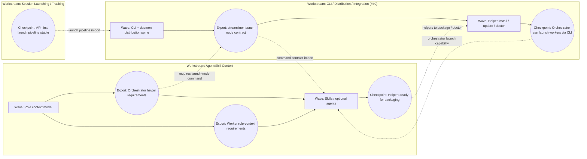

# Role & Context Packages

## Stage

Shaped; foundational candidate (2026-06 coverage partition; un-merged from Workstream Design).

## Coverage Partition (2026-06 refactor)

**Foundational candidate** (sibling of WS-A). **Owns (C3-roles):** the role + context packages for
Streamliner-aware sessions — designer, workstream-formation, orchestrator, worker, and
closure-review — plus helper distribution edges.

**Un-merged from WS-B Workstream Design Altitude** so the widely-consumed role contract has a
single owner. **Consumed by:** WS-C Local Actor Fabric (binds the orchestrator/worker role to an
actor at launch), WS-D Node Handoff (worker hot-work guidance), WS-E Project Surface (issue-worker
role).

> **Watch (builder):** if this proves too small at formation/implementation, reconsider folding it
> back into WS-B Workstream Design Altitude. Tracked as a learning check, not a blocker.

## Seed Idea

Add Streamliner-aware agents or skills to the plugin so orchestrator and worker sessions can load the concepts, roles, and operating context they need without repeated manual prompting. The builder should not need to repeatedly explain Streamliner, workstreams, orchestrators, workers, context packages, or session responsibilities.

## Why It Matters

Streamliner depends on role-aware AI sessions, but today the builder has to restate the Streamliner model repeatedly: what a workstream is, what an orchestrator does, what a worker should read, how node context works, and how to report changes back for reconciliation.

That repeated prompting is both tedious and risky. It creates session-to-session drift, makes workers push back on valid Streamliner operating patterns, and makes role expectations live in chat instead of durable project/plugin artifacts.

## Candidate Scope

### In Scope

- Define the role-context model for Streamliner-aware sessions.
- Decide when Streamliner should provide skills, custom agents, launch prompts, or generated context packages.
- Add reusable context for at least four roles/modes:
  - Project Workstream Designer: shapes multiple candidate workstreams and their geometry.
  - Workstream Formation: bottoms out one shaped candidate into executable workstream artifacts.
  - Workstream Orchestrator: runs a formed workstream through graph, waves, workers, gates, reconciliation, and closure.
  - Workstream Node Worker: executes one node from the context package and reports documentation/design/scope impacts.
- Keep role guidance composable so the builder can still direct a session freely without being trapped in a rigid custom-agent persona.
- Connect role context to documentation authority: role guidance should point to Design, Architecture, User Guide, and workstream artifacts rather than duplicating them wholesale.
- Decide how node sessions automatically receive worker role context at launch.

### Out of Scope

- Replacing the context package with skills or custom agents.
- Treating plugin-provided role guidance as project design authority.
- Building a full multi-workstream dependency model.
- Fully designing hot-work behavior; this workstream should enable that follow-on work.

### Deferred

- Automatically generating skills from docs.
- UI for selecting roles or launching role-specific sessions.
- Portfolio-level agents that manage multiple projects at once.
- Full custom-agent marketplace or versioning strategy.

## Decisions and Working Assumptions

- Prefer **skills as the primary context mechanism** because they are composable. A session can load a Streamliner role while still staying loose enough for the builder to direct it.
- Use **custom agents as optional entry points**, not the only mechanism. A custom agent is appropriate when the whole session is intentionally operating as a Workstream Designer or Orchestrator, but it should be a thin wrapper over the same shared role guidance.
- A custom agent should not be the source of truth for Streamliner behavior. It should load or point to shared role docs/skills so agent and skill behavior do not drift.
- The node-worker role should be loaded automatically for launched worker sessions. This could be through the launch prompt, a plugin-provided skill, generated context-package instructions, or a combination.
- The context package remains the node-specific source of truth. Skills/agents provide role and operating model; `context.md` provides the selected node's mission, workstream state, and hints.
- The plugin already exists for session lifecycle hooks, but this workstream may need to expand plugin packaging to include skills, agent definitions, or role documentation if Copilot CLI supports distributing them that way.
- The role model should likely include one shared `streamliner-core` context plus role-specific layers for designer, orchestrator, worker, and eventually reconciler.
- Dogfooding suggests three primary skills above node work: Project Workstream Design, Workstream Formation, and Workstream Orchestration. They may share one Streamliner Core context and can still have optional custom-agent entry points.

## Role Context Model

### Streamliner Core

Shared vocabulary and operating model used by every role:

- builder, workstream designer, orchestrator, worker, reconciler;
- design layer, architecture docs, user guide, shaping notes, workstream artifacts;
- brief, graph, node, gate, checkpoint, wave, context package;
- work geometry: boundaries, contracts, imports, exports, dependencies, feedback signals.

This should be short and navigational. It should tell sessions where authoritative docs live rather than copying the docs.

### Project Workstream Designer

Used when the builder is shaping ambiguous work into several candidate workstreams within one project and trying to understand their geometry.

Expected behavior:

- capture candidate workstreams in shaping notes;
- reason at workstream scale, not first-issue scale;
- identify boundaries, imports, exports, gates, and cross-workstream edges;
- produce handoff briefs for focused formation sessions;
- avoid detailed implementation planning unless explicitly requested.

Likely packaging:

- Skill for loose interactive sessions.
- Optional custom agent for dedicated project workstream-design sessions.

Naming decision: use **Project Workstream Designer**. A project is the grouping boundary for related workstreams that can depend on each other. A portfolio is the builder's broader collection of projects and should be a later, higher-level concept if needed.

### Workstream Formation

Used after a candidate has been shaped and the builder wants to create the actual workstream artifacts.

Expected behavior:

- read the shaping handoff, related design docs, architecture docs when present, and known imports/exports;
- continue scoped design thinking for this one workstream;
- decide the workstream's initial brief, graph, waves, gates, checkpoints, and export/import declarations;
- create or update `brief.md` and `graph.json`;
- create the parent tracker issue and initial node issues/specs;
- identify design-session nodes needed before execution;
- leave later-wave details sketchy when they depend on earlier outcomes.

Likely packaging:

- Skill for sessions that turn a shaped candidate into artifacts.
- Optional custom agent if the whole session is dedicated to formation.

### Workstream Orchestrator

Used when a formed workstream is ready to execute.

Expected behavior:

- read the workstream artifacts, design docs, architecture docs when present, and current operational state;
- maintain `brief.md` and `graph.json` as reality unfolds;
- promote waves and refine nodes/gates/tracker-backed issues;
- launch or coordinate node workers;
- reconcile worker output back into the workstream graph and downstream issues.
- run workstream-level closure reviews that evaluate final PRs and completed node/issues against the whole workstream intent before the workstream is closed.

Likely packaging:

- Skill for any session that needs to act as an orchestrator.
- Optional custom agent for sessions that should primarily own one workstream.

### Workstream Node Worker

Used at the start of every launched node session.

Expected behavior:

- read the generated context package first;
- understand it is executing one node inside a larger workstream;
- respect node and workstream boundaries;
- update code/docs/tests as needed;
- report scope, design, architecture, user-guide, and downstream impacts for reconciliation;
- understand that hot work may be valid when it stays inside workstream boundaries and is communicated clearly.

Likely packaging:

- Launch-time prompt/context behavior first.
- Skill or plugin-provided role instructions second.
- Probably not a custom agent by default, because worker sessions need to remain flexible for arbitrary coding tasks.

### Workstream Closure Review

The orchestrator role should include a review mode for the end of a workstream or major wave. This is broader than a normal PR review because it evaluates the body of work against the whole workstream, not only the final PR's local diff.

This review should happen when:

- a final workstream PR is ready;
- the last wave has completed;
- multiple node issues are being closed together;
- the builder wants confidence that the workstream still matches its original purpose after hot work, reconciliations, and scope adjustments.

Expected review inputs:

- original shaping note or handoff brief;
- workstream `brief.md`;
- workstream `graph.json`, including completed nodes, gates, and checkpoints;
- linked node issues/specs;
- final PR and any earlier node PRs included in the workstream branch;
- design docs, architecture docs, and user-guide docs relevant to the workstream;
- known exports/imports and downstream dependencies.

Expected review questions:

- Did the completed work satisfy the workstream purpose and boundaries?
- Did hot work stay inside the workstream boundary and get reconciled into artifacts?
- Are all completed node issues truly represented in the final PR/body of work?
- Did any original goals get dropped, superseded, or silently changed?
- Are design docs, architecture docs, user docs, and workstream artifacts consistent with what shipped?
- Are exported contracts/checkpoints accurate and safe for downstream workstreams to consume?
- Are there unresolved risks that should block closing the workstream or become follow-up workstreams?

This is not just another code review. A PAW or PR review can still be useful for local correctness, but workstream closure review is an orchestrator responsibility: reconcile the final artifact set against the workstream's intent and geometry.

Output should be a closure assessment:

- close-ready / changes-needed / follow-up-required;
- mismatches between original intent and shipped reality;
- documentation and design updates needed;
- downstream issue/workstream updates needed;
- exports now available, including availability state;
- recommended final gate decision for the builder.

## Custom Agents vs Skills

The core distinction should be:

| Mechanism | Best for | Risk |
|---|---|---|
| Skill | Loading role knowledge into an otherwise flexible session. | May rely on the user or launch prompt to activate it. |
| Custom agent | Starting a session whose main job is a specific role. | Can over-pin the session and make it resist useful builder direction. |
| Launch prompt/context package | Automatically orienting a launched worker to a specific node. | Can become too verbose or duplicate docs if not kept reference-first. |
| Plugin hook/package | Distribution and automation around Copilot CLI sessions. | Must avoid becoming the authoritative source for design behavior. |

Recommendation: build **skills first**, then add custom agents as thin convenience wrappers over those skills where the role is the point of the session.

This preserves flexibility while still making Streamliner roles loadable and repeatable.

## Dependencies

### Depends On

- [Workstream Design Mode](workstream-design-mode.md), for role definitions and the higher-level shaping workflow.
- [Documentation System](documentation-system.md), if agent/skill context should draw from a clearer documentation hierarchy.

### Enables

- [Worker Hot Work and Reconciliation](worker-hot-work-reconciliation.md), because hot-work behavior should be part of worker role guidance.

### Related Candidates

- [Multi-Workstream Dependencies](multi-workstream-dependencies.md), because orchestrator or designer roles may need to reason across multiple workstreams.

## Workstream Shape

This is a workstream-sized effort. Its broad shape is to define and implement Streamliner role context across plugin, skills, optional agents, and launch-time worker context.

Likely work areas:

- Inventory current Copilot CLI plugin, skill, and agent packaging options.
- Define shared Streamliner Core context.
- Define role-specific guidance for Project Workstream Designer, Workstream Formation, Workstream Orchestrator, and Workstream Node Worker.
- Decide how role guidance references docs without duplicating them.
- Add plugin/project-distributed skills or equivalent role artifacts.
- Add optional custom-agent entry points if the packaging supports them cleanly.
- Ensure launched node sessions automatically receive worker-role orientation.
- Define orchestrator closure-review behavior for final workstream PRs and completed waves.
- Update documentation so users understand when to use skills vs custom agents.

## Exported Interfaces and Dependencies

### Imports

- Documentation System (`.streamliner/workstreams/documentation-system/`): documentation taxonomy, docs-discovery conventions, optional documentation-family context flow, and worker documentation-impact reporting expectations.
- Workstream Design Mode: role semantics for designer sessions and work-geometry primitives.
- Distribution/Integration Workstream ([GitHub issue #40](https://github.com/lossyrob/streamliner/issues/40)): CLI, daemon, Copilot plugin install/doctor/update, helper distribution, and agent-friendly launch entrypoints.
- Session launching/tracking work: stable API-first launch pipeline and context-package seam for graph-launched node workers.

### Exports

- Role-context model for Project Workstream Designer, Workstream Formation, Orchestrator, and Node Worker.
- Packaging decision for skills vs custom agents.
- Worker launch-context expectations for downstream hot-work guidance.
- Workstream closure-review expectations for orchestrator sessions.
- Shared Streamliner vocabulary that later multi-workstream dependency tooling can reuse.
- Requirements for distribution surfaces: what skills/agents/helpers need to be installed, updated, diagnosed, and versioned by the CLI/plugin distribution workstream.
- Orchestrator-helper requirements for launching node workers without using the UI.

### Edge with Distribution/Integration Workstream

GitHub issue [#40](https://github.com/lossyrob/streamliner/issues/40) already defines a future "CLI, daemon, and Copilot integration distribution" workstream. This agent/skill context candidate should not absorb that workstream.

The boundary should be:

| Concern | Agent/Skill Context workstream | Distribution/Integration workstream |
|---|---|---|
| Role semantics | Owns the content model for designer, orchestrator, worker, and future reconciler guidance. | Consumes those role artifacts for packaging and installation. |
| Skills/agents | Defines what skills/agents should teach and how they avoid drifting from docs. | Installs, updates, verifies, and diagnoses those helpers. |
| Worker launch context | Defines what worker role guidance must be present at node start. | Exposes `streamliner launch-node` or equivalent entrypoints that deliver that context through the product launch pipeline. |
| CLI/API calls | Identifies what role helpers need from Streamliner. | Owns the CLI/API command surface, daemon control, output modes, safety, and trust model. |
| Doctor/health | Defines what helper/context degradation should be detectable. | Implements `doctor` or health checks for missing/stale plugin, skills, agents, helpers, and daemon integration. |

The exported interface from this workstream to issue #40 should be a compact role-helper manifest or equivalent specification:

- helper names and intended roles;
- where their source content lives;
- how they reference design/architecture/user docs;
- version/compatibility expectations;
- what install/update/doctor should verify;
- which CLI/API commands the helpers expect to call.

Conversely, issue #40 should export the stable distribution and automation substrate back to this workstream:

- how helpers are installed and discovered;
- how a session can call Streamliner safely;
- how helper versions are checked;
- how `launch-node` or equivalent commands pass worker role context.

### Orchestrator launch-node contract

The Workstream Orchestrator role should be able to launch node workers without relying on the dashboard UI. That creates a direct interdependency with the Distribution/Integration workstream:

- The Agent/Skill Context workstream defines that an orchestrator helper needs an instruction like: use `streamliner launch-node --workstream <id> --node <id>` when launching a worker for a graph node, rather than manually reconstructing prompts or asking the builder to click the UI.
- The Distribution/Integration workstream provides the actual `streamliner launch-node` command or equivalent stable API entrypoint.
- The session-launching product workstream provides the underlying launch pipeline that both the UI and CLI entrypoint call.

This edge should be treated as an import/export contract:

| Direction | Contract |
|---|---|
| Agent/Skill Context -> Distribution | Orchestrator helper requirements: command intent, required arguments, expected machine-readable output, error/doctor expectations, and role-context handoff needs. |
| Distribution -> Agent/Skill Context | Stable command/API behavior: launch-node invocation shape, safety prompts or preview modes, returned launch/session identifiers, and failure diagnostics. |
| Session Launching -> both | API-first launch pipeline that assembles context, prepares PAW, creates launch claims, launches the terminal/session, and binds registry state. |

The orchestrator helper should not duplicate the launch pipeline. Its job is to know **when and how to call** the product-owned entrypoint, then reconcile the returned launch/session information into the workstream graph and brief.

### Mock work-geometry diagram

This is a high-level sketch of how the Agent/Skill Context workstream connects to the Distribution/Integration workstream and the existing Session Launching work. It intentionally stays above individual task nodes. Waves/checkpoints are shown as containers and exports.

In a single-workstream UI, the Agent/Skill Context graph should show that its orchestrator-helper work has an external dependency on the Distribution/Integration workstream's `launch-node` export. In an all-workstreams canvas, that dependency could render as a dotted edge between checkpoints/exports rather than as a node-level dependency.

## Open Questions

- Should this start as plugin documentation, a skill, a custom agent, or some combination?
- What minimal context should an orchestrator load at launch?
- What minimal context should a worker load at launch?
- How should plugin-provided context avoid drifting from project design docs?
- What exact packaging mechanisms does Copilot CLI support for plugin-distributed skills and custom agents?
- Should Workstream Designer and Orchestrator each have both a skill and a custom agent?
- Should the node-worker role be a skill, a generated prompt section, a plugin-provided launch behavior, or all three?
- How should a session declare or record which Streamliner role context it loaded?

## Handoff Brief

Create a Streamliner Agent and Skill Context workstream.

The workstream should define and implement reusable Streamliner role context for Workstream Designer, Workstream Orchestrator, and Workstream Node Worker sessions. It should prefer composable skills as the primary mechanism, with optional custom agents as thin role-specific entry points where appropriate. Role guidance should be reference-first: it should load the Streamliner operating model and point to authoritative Design, Architecture, User Guide, shaping, and workstream artifacts rather than duplicating them.

The workstream should define a shared Streamliner Core context plus role-specific guidance for designer, orchestrator, worker, and eventually reconciler behavior. The orchestrator role should include graph/wave/node coordination, worker launch behavior, reconciliation, and workstream closure review for final PRs or completed waves. The worker role should be automatically present in launched node sessions and should understand context packages, workstream boundaries, documentation impact, and downstream reconciliation needs.

This workstream has an explicit dependency edge with the Distribution/Integration workstream in GitHub issue #40. Agent/Skill Context should define the role-helper requirements, helper manifest shape, expected install/doctor/version checks, and orchestrator `launch-node` usage. The Distribution/Integration workstream should provide the actual CLI/API distribution spine, including `streamliner launch-node` or an equivalent stable entrypoint. This workstream should also import the Session Launching workstream's API-first launch pipeline and export role/context requirements to Worker Hot Work and Multi-Workstream Dependencies.

The orchestrator should decide internal waves and packaging details. The shaped boundary is role-context content, skill/custom-agent strategy, launched-worker orientation, closure-review behavior, and the helper/distribution contracts needed for other workstreams to consume.
