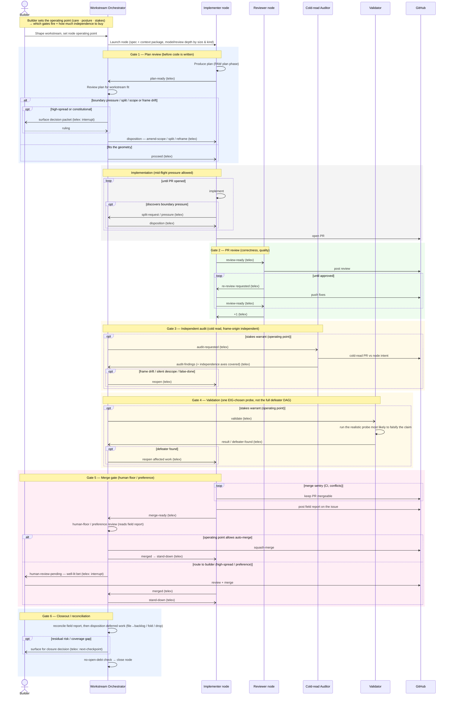
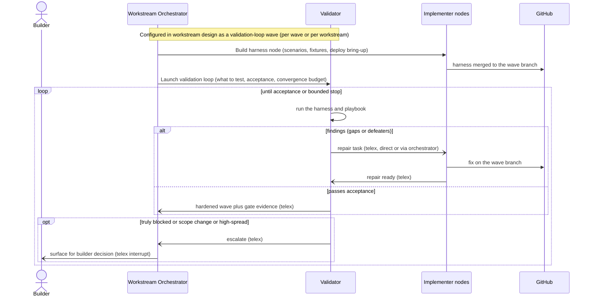

# Node Gate Flow — orchestrator, node sessions, and builder attention

> **Shaping reference, not committed design.** This sketches the end-to-end control
> flow of a single node through the **gate ladder**: the workstream orchestrator, the
> implementer / reviewer / auditor / validator node sessions, and the builder,
> coordinated over **telex** with PR actions on **GitHub**. It makes the
> work-geometry backward pass concrete — §5 witnessing, §7 boundary pressure, §12
> production-independence — and grounds the **Operating Point & Attention**, **Node
> Handoff, Boundary Pressure & Reconciliation**, **Checkpoint & Closeout**, and
> **Backlog Orchestration / Autonomous Execution** candidates. It is a frame to react
> to, not a spec; the open choices are noted at the end.

The spine: every gate is one shape — a **locus** produces a typed judgment → the
controller routes it → the **operating point × spread** decides hard-stop /
preference-debt / silent-default → a **disposition + records** result → **telex**
carries the transition. The builder is spent only where it pays.

## Sequence

## Legend

**Loci and the independence ladder.** Each gate adds a locus independent of the work
on a different axis, terminating at the builder:

- **Orchestrator** — frame/scope independence (owns the workstream geometry).
- **Reviewer** — correctness (separate session; independence is *partial* — may share
  the implementer's frame/prompt).
- **Auditor** — cold frame-origin independence; catches the frame drift and false-done
  the sharing-frame reviewer misses (§12). Records *which axes* it is independent on.
- **Validator** — success-criterion independence; witnesses that the outcome obtains.
- **Builder** — values; the terminal witness (§6 human floor).

**Telex vs GitHub.** Telex carries the async coordination wakeups + pointers between
sessions (`plan-ready`, `proceed`, `split-request`, `review-ready`, `audit-requested`,
`validate`, `merge-ready`, `human-review-pending`, `merged`, `stand-down`). GitHub stays
the source of truth for PRs, reviews, and merges.

**The operating point is the dial.** It decides (a) **which gates fire and how much
independence to buy** — gates 3 and 4 fire only when stakes warrant; the merge gate
auto-merges or routes to the builder — and (b) **surface-worthiness** at each gate
(hard-stop / preference-debt / silent-default). A low-stakes prototype node may skip the
audit and validation and auto-merge; a high-stakes craft node runs the full ladder up to
a human-floor merge.

**Builder attention points.** Up front (sets the operating point), and then only at:
plan-gate escalation (high-spread geometry), the merge route-to-human, and closure
residual risk. Everything else runs without the builder.

**Gates are also harvest points.** The plan gate harvests early splits/deferrals; the
merge gate harvests preference-debt + a risk receipt; the closeout gate harvests deferred
work into the backlog. Attention layer + gates + backlog + work-loss are one system.

## Locus roles — the Auditor and the Validator

These two are easy to conflate; they check different things and load different context.

### Cold-read Auditor (Gate 3) — an *intent* auditor, not a correctness checker

**Context loaded.** A fresh session that did *not* implement the work: the workstream **brief**
(intent + boundaries), the **node spec / plan**, the **PR diff**, the relevant **design-layer**
references, and the implementer's **field report** (what it claims). Its value is the cold read — it
was never in the implementation conversation, so it does not inherit the implementer's frame.

**Mission (not correctness — that's the reviewer/validator).** At the intent / geometry level:
- **Coverage** — does the work actually cover the node's slice of intent, beyond claimed-done?
- **Deferred work** — is there uncovered or deferred work that was never flagged or dispositioned?
- **Unflagged high-spread choices** — were consequential forks silent-defaulted that should have been
  surfaced as preference-debt or to the builder?
- **Drift** — did the work drift from the workstream frame?

**Output.** Findings as decision packets to the orchestrator — uncovered work → debt, unflagged fork
→ surface, drift → reframe, coverage gap → reopen. It records *which* independence axes it holds
(frame-origin, prompt, context) and which it shares; independence is partial and named (§12).

**Implementable today?** Yes — a role/context package plus an intent-audit prompt over the actor
fabric. The only hard requirement is independence: a fresh session that did not write the code. No new
machinery beyond a launch profile.

### Validator — a *loop*, not a pass/fail point

The per-node witness (Gate 4) is deliberately light: a cheap probe that the claimed outcome obtains.
Real **hardening** is a different structure — a **validation-loop wave** — because validation needs a
**harness**, and the harness is real work (scenarios, fixtures, deployed bring-up) shaped as its own
node. So validation is altitude-configurable:

- **per node** — a light witness probe (often overkill; use when cheap);
- **per wave** — the common case: a validation-loop wave that hardens the wave;
- **per workstream** — a final validation-loop wave before closure.

*Where the validation moments sit is part of the workstream design* — the canonical layout ends with a
validation-loop wave (see [VALIDATION-LOOPS.md](../../VALIDATION-LOOPS.md) and
[WORKSTREAM-DESIGN.md](../../WORKSTREAM-DESIGN.md)). Until defeaters are auto-generated by information
gain, these validations are **crafted** in design.

The loop does not stop at pass/fail. On findings it **routes repair tasks to implementer nodes over
telex** (directly or via the orchestrator), they fix on the wave branch, and it re-runs — converging to
a **hardened wave** rather than a stuck red result. Converged means more than the harness re-passing:
the strongest stop is when a fresh probe — different inputs, a different path, or an evaluator other
than the one that drove the repairs — finds nothing new, so the loop is confirming the work, not just
its own fixes. It pauses for the builder only when truly blocked, scope changes, or a high-spread choice
appears. This is another **source for the autonomous execution engine** (findings → repair tasks →
implementers), and it is the convergent-validation pattern.

## The validation loop

## What is buildable now vs. seeded vs. deferred

- **Now (cheap, high value):** Gate 1 (plan review — catches geometry problems before
  code), Gate 5 (merge gate — the backlog-orchestrator skill already does it), Gate 6
  (closeout — partly shipped via the reconciliation note, #114). These need only the
  actor fabric/telex, the orchestrator role, boundary-pressure handling, and the
  operating point deciding which fire.
- **Medium:** Gate 3 (the cold-read auditor) — one extra independent session.
- **Seed, not the full system:** Gate 4's per-node witness — a single information-gain-chosen
  probe, not the defeater DAG. The wave-level **validation-loop** (harness + telex-routed repairs +
  convergence) is the convergent-validation pattern; the harness is shaped work, so it is a medium
  build, not a free gate.
- **Deferred:** the full defeater DAG, basis-relative spread estimation, the probe economy.

## What stays open

- Gate 3 (audit) and Gate 4 (validation) are **distinct loci** — the auditor reads *intent* (a cold
  read), the validator witnesses *outcome* (a harness-backed loop). Open: whether a tiny node ever
  needs both, or defaults to neither.
- How much of Gate 1's disposition is orchestrator-automatic vs. builder-surfaced.
- Where the validation moments sit (node / wave / workstream) — a per-node-kind default profile,
  then overridden by the workstream design and the operating point.
