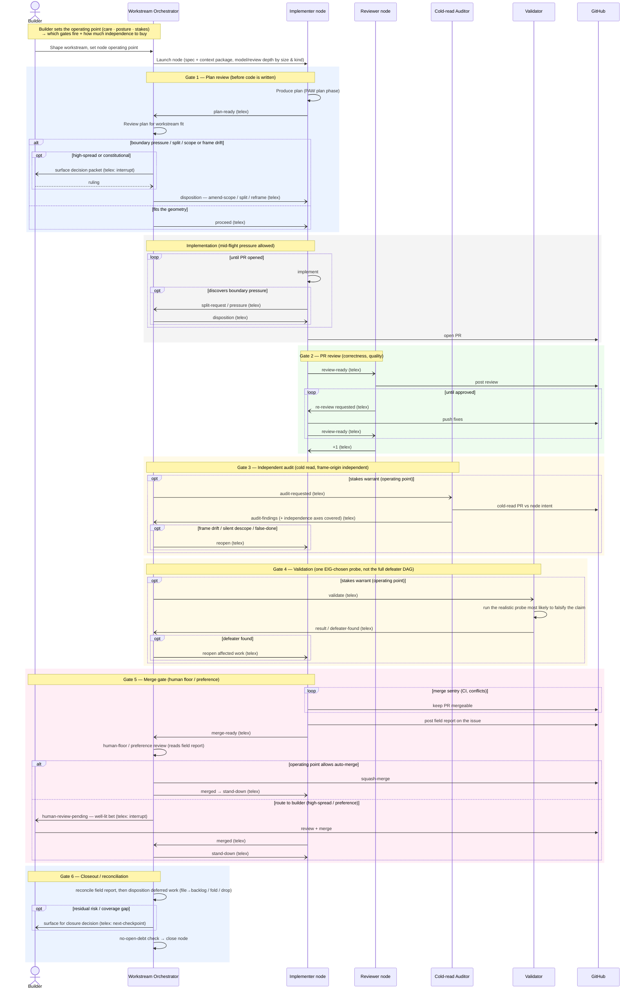

# Node Gate Flow — orchestrator, node sessions, and builder attention

> **Shaping reference, not committed design.** This sketches the end-to-end control
> flow of a single node through the **gate ladder**: the workstream orchestrator, the
> implementer / reviewer / auditor / validator node sessions, and the builder,
> coordinated over **telex** with PR actions on **GitHub**. It makes the
> work-geometry backward pass concrete — §5 witnessing, §7 boundary pressure, §12
> production-independence — and grounds the **Operating Point & Attention**, **Node
> Handoff, Boundary Pressure & Reconciliation**, **Checkpoint & Closeout**, and
> **Backlog Orchestration / Autonomous Execution** candidates. It is a frame to react
> to, not a spec; the open choices are noted at the end.

The spine: every gate is one shape — a **locus** produces a typed judgment → the
controller routes it → the **operating point × spread** decides hard-stop /
preference-debt / silent-default → a **disposition + records** result → **telex**
carries the transition. The builder is spent only where it pays.

## Sequence

## Legend

**Loci and the independence ladder.** Each gate adds a locus independent of the work
on a different axis, terminating at the builder:

- **Orchestrator** — frame/scope independence (owns the workstream geometry).
- **Reviewer** — correctness (separate session; independence is *partial* — may share
  the implementer's frame/prompt).
- **Auditor** — cold frame-origin independence; catches the frame drift and false-done
  the sharing-frame reviewer misses (§12). Records *which axes* it is independent on.
- **Validator** — success-criterion independence; witnesses that the outcome obtains.
- **Builder** — values; the terminal witness (§6 human floor).

**Telex vs GitHub.** Telex carries the async coordination wakeups + pointers between
sessions (`plan-ready`, `proceed`, `split-request`, `review-ready`, `audit-requested`,
`validate`, `merge-ready`, `human-review-pending`, `merged`, `stand-down`). GitHub stays
the source of truth for PRs, reviews, and merges.

**The operating point is the dial.** It decides (a) **which gates fire and how much
independence to buy** — gates 3 and 4 fire only when stakes warrant; the merge gate
auto-merges or routes to the builder — and (b) **surface-worthiness** at each gate
(hard-stop / preference-debt / silent-default). A low-stakes prototype node may skip the
audit and validation and auto-merge; a high-stakes craft node runs the full ladder up to
a human-floor merge.

**Builder attention points.** Up front (sets the operating point), and then only at:
plan-gate escalation (high-spread geometry), the merge route-to-human, and closure
residual risk. Everything else runs without the builder.

**Gates are also harvest points.** The plan gate harvests early splits/deferrals; the
merge gate harvests preference-debt + a risk receipt; the closeout gate harvests deferred
work into the backlog. Attention layer + gates + backlog + work-loss are one system.

## What is buildable now vs. seeded vs. deferred

- **Now (cheap, high value):** Gate 1 (plan review — catches geometry problems before
  code), Gate 5 (merge gate — the backlog-orchestrator skill already does it), Gate 6
  (closeout — partly shipped via the reconciliation note, #114). These need only the
  actor fabric/telex, the orchestrator role, boundary-pressure handling, and the
  operating point deciding which fire.
- **Medium:** Gate 3 (the cold-read auditor) — one extra independent session.
- **Seed, not the full system:** Gate 4 (validation) — start with a single EIG-chosen
  probe, not the defeater DAG.
- **Deferred:** the full defeater DAG, basis-relative spread estimation, the probe economy.

## What stays open

- Whether Gate 3 (audit) and Gate 4 (validation) are one independent-witness locus or two.
- How much of Gate 1's disposition is orchestrator-automatic vs. builder-surfaced.
- Whether the gate ladder is declared as a per-node-kind default profile
  (design / implementation / validation), then overridden by the operating point.
